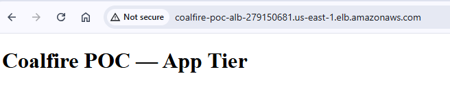

# SRE AWS Technical Challenge

## **Challenge Overview**
**Part One: Deployable Infrastructure** 
- Create a proof-of-concept **AWS environment using Terraform.** The environment will host a basic web server with proper network segmentation and security controls. Terraform modules must be used.

**Part Two: Operational Analysis** 
- Analysis of deployed Infrastructure (Security gaps, availability issues, Cost optimization, Operational shortcomings)
- Improvement plan in regards to infrastructure analysis
- Runbook-style notes
---

### **Architecture Diagram**
<details> 
<summary><strong>Click to expand Diagram</strong></summary>


</details>

## **Part One: Deployable Infrastructure**

### **Solution Overview**
This Proof of Concept (POC) deploys a simple three-tier AWS infrastructure using Terraform. It demonstrates how to provision a secure environment with public management access, private application servers, and a scalable front-end behind an Application Load Balanceer.

<details>
<summary><strong>AWS Components included</strong></summary>

- **Amazon VPC (Virtual Private Cloud)** – Isolated network environment for all AWS resources.
- **Subnets** – Logical subdivisions of the VPC.
- **Internet Gateway (IGW)** – Provides internet access for public subnets.
- **NAT Gateway** – Allows private subnets outbound access.
- **Route Tables** – Control how network traffic is directed.
- **Elastic IPs (EIPs)** – Static IPv4 addresses for NAT Gateways.
- **Amazon EC2** – Virtual servers in the cloud.
- **Auto Scaling Group (ASG)** – Manages the number of app instances.
- **Launch Template** – Blueprint for app instances.
- **Application Load Balancer (ALB)** – Distributes HTTP traffic.
- **Target Group** – Defines EC2 instances behind ALB.
- **Security Groups (SGs)** – Virtual firewalls.
- **Key Pairs** – SSH public/private keys.
- **Amazon AMI** – Base images for EC2.
</details>

### **Why it works**
- Bastion Host = secure way in.
- App tier = private, scalable, serves traffic through ALB only.
- Terraform modules = everything automated and repeatable.
- Easy to extend later (backend subnets ready for a DB/cache).
---
## **Deployment Instructions**
### **Prerequisites**
- Terraform ≥ 1.6
- AWS CLI installed and configured with appropriate credentials.
- Clone the repo.
- An SSH keypair on your local machine named (Instructions below).
- The public IP/CIDR you’ll SSH from. [What Is My IP Address](https://whatismyipaddress.com/)

### **Generate SSH keys**
```bash
ssh-keygen -t rsa -b 4096 -C "Coalfire-SRE-POC"
mgmt_id_rsa
```
> For this POC we’re using the same key for the management and the app instances (attached via Launch Template).

Place copy of public key
```bash
envs/mgmt_id_rsa.pub 
```
Place copy of private key --- Placing the key here allows us to copy it onto the management instance later on.
```bash
C:\Users\<username>\.ssh\
```

### **Configuration**
The project includes a default **`poc.auto.tfvars`** file with placeholder values.
Before running Terraform, update this file to match your environment:

- **AWS Profile:** If you use multiple AWS profiles, replace the **aws_profile** value with the profile you want Terraform to use.
- **IP Address:**  Update the **allowed_ssh_cidr** value with your own IP address (e.g., 203.0.113.10/32) so you can connect via SSH.
> *Disclaimer:* The use of an **AWS profile configuration** in `poc.auto.tfvars` was added because I work with multiple AWS profiles.  
> I recognize that in a typical POC this would not usually be included.  

### **Initialize & Deploy**
```bash
terraform init
terraform fmt -recursive
terraform validate
terraform plan
terraform apply
```
### **Outputs to note**
After `apply`, Terraform will print out the following:
- `alb_dns_name` - which we will be used to verify website availability.
- `management_public_ip` - For SSH

### **Verify the site**
```bash
http://<alb_dns_name>
```
### **SSH workflow:**
### From local machine ---> Management instance
```bash
scp -i ~/.ssh/mgmt_id_rsa ~/.ssh/mgmt_id_rsa ec2-user@<management_public_ip>:~/.ssh/app.pem
```
### On management instance, run the following command (Fix SSH permission)
```bash
chmod 600 ~/.ssh/app.pem
```
### **SSH into Managment instance**
```bash
ssh -i ~/.ssh/mgmt_id_rsa ec2-user@<management_public_ip>
```
### From Management instance ---> app instance
```bash
ssh -i ~/.ssh/app.pem ec2-user@<app_private_ip>
```
### **Cleanup**
```bash
terraform destroy
```
---
## Evidence of Successful Deployment
<details>
  <summary><strong>Terraform Apply Log (click to expand)</strong></summary>

  See full log here: [terraform-apply.log](./logs/terraform-apply.log)
</details>
<details>
  <summary><strong>Screenshots (click to expand)</strong></summary>

  **1. Terraform apply completed successfully**  
  

  **2. Application accessible via ALB DNS**  
  

  **3. EC2 instances running (App + Mgmt)**  
  

  **4. SSH into Management Instance**  
  

  **5. SSH from Mgmt → App Instance**  
  
</details>

---

## **Part Two: Operational Analysis & Improvement Plan**
<details><summary><strong>Analysis</strong></summary>

What Security gaps exist?
- Bastion host has direct SSH access from the internet, which adds exposure.
- Application servers share the same keypair as the bastion.

What availiability issues exist?
- Single ALB and NAT Gateway per AZ, no redundancy outside of the region.
- Auto Scaling is configured, but there’s no health check or failover for the bastion.

What Cost optimization opportunities exist?
- NAT Gateways in each AZ drive up cost for a POC.
- EC2 instances are on-demand. Reserved instances or savings plan should be considered. 

What are some operational shortcomings?
- No backups or recovery plan for the EC2s.
- No monitoring or alerting
- No logging beyond default VPC flow logs
- Patching and key rotation aren’t automated
</details>

<details><summary><strong>Improvement</strong></summary>

Security Gaps
- Bastion direct SSH - Move to SSM Session Manager or Implement VPN to access. This would be first priority because it’s the biggest exposure.
- Shared keypair - Use separate keys per tier or manage access with Secrets Manager/SSM. Second priority since it limits exposure if a key is compromised.

Availability Issues
- Single ALB/NAT per AZ - Add cross-AZ redundancy and failover.
- No bastion failover - Use SSM instead of relying on a single EC2 or add a backup bastion.

Cost Optimizations
- Multiple NATs - For a POC, one shared NAT is fine. Cuts cost fast.
- On-demand EC2 - Using reserved instances or savings plans.

Operational Shortcomings
- Backups - Add AMI snapshots or backup policies
- Monitoring/alerting - CloudWatch alarms for health and cost.
- Logging - Enable ALB logs and CLoudTrail.
- Patching/key rotation - Configure SSM Patch Manager.

</details>

## **Supporting Notes**

<details><summary><strong>Design Decisions</strong></summary>

- Kept the design minimal but still close to a real-world three-tier setup.
- Used an Auto Scaling Group instead of individual EC2s for the app tier to show scalability.
- Bastion was deployed as a single instance for simplicity, even though it’s a single point of failure.
- NAT Gateways were placed per AZ to follow best practices, even though it adds cost.
- Chose Apache as the app server because it’s easy to validate with a browser test.
</details>

<details><summary><strong>Assumptions</strong></summary>

- One operator IP would be allowed for SSH into the bastion.
- Using the same SSH keypair for bastion and app servers is fine for a POC.
- Backend layer wasn’t needed yet but subnets were reserved for future use.
- High availability across regions wasn’t a requirement since this is a demo and not production.

</details>

<details><summary><strong>Challenges Encountered</strong></summary>

- Key management - App instances initially weren’t accepting SSH because of keypair settings in the launch template. Fixed by aligning the app ASG to the bastion’s keypair. Also forgot to CHMOD the key once copied over.
- Terraform module complexity - Coalfire modules added extra required inputs not needed for the POC. Switched to community modules for simplicity.
- Connectivity validation - Initially the ALB didn’t serve content. At one point Apache did not properly install. 

</details>

<details><summary><strong>Solutions to Challenges</strong></summary>

- Used a single keypair across tiers for now.
- Used lightweight modules.
- Verified end-to-end connectivity with both CLI outputs and screenshots to back up the deployment.

</details>

---

## **If This Went to Production**
If this were production, I’d swap bastion SSH for SSM Session Manager, give the app servers their own access controls with IAM roles, and add monitoring and logging with CloudWatch and ALB/VPC logs. I’d also add multi-AZ redundancy, look at savings plans or spot instances to cut costs, and make sure backups, patching, and key rotation are automated.

## **Terraform Resource References**

<details>
  <summary><strong>Click to expand</strong></summary>

- **VPC + Subnets**  
  - VPC: [aws_vpc](https://registry.terraform.io/providers/hashicorp/aws/latest/docs/resources/vpc)  
  - Subnets: [aws_subnet](https://registry.terraform.io/providers/hashicorp/aws/latest/docs/resources/subnet)  

- **Networking**  
  - Internet Gateway: [aws_internet_gateway](https://registry.terraform.io/providers/hashicorp/aws/latest/docs/resources/internet_gateway)  
  - NAT Gateway: [aws_nat_gateway](https://registry.terraform.io/providers/hashicorp/aws/latest/docs/resources/nat_gateway)  
  - Security Group: [aws_security_group](https://registry.terraform.io/providers/hashicorp/aws/latest/docs/resources/security_group)  

- **Load Balancing**  
  - Application Load Balancer: [aws_lb](https://registry.terraform.io/providers/hashicorp/aws/latest/docs/resources/lb)  
  - Target Group: [aws_lb_target_group](https://registry.terraform.io/providers/hashicorp/aws/latest/docs/resources/lb_target_group)  
  - Listener: [aws_lb_listener](https://registry.terraform.io/providers/hashicorp/aws/latest/docs/resources/lb_listener)  

- **Compute**  
  - Launch Template: [aws_launch_template](https://registry.terraform.io/providers/hashicorp/aws/latest/docs/resources/launch_template)  
  - Auto Scaling Group: [aws_autoscaling_group](https://registry.terraform.io/providers/hashicorp/aws/latest/docs/resources/autoscaling_group)  
  - EC2 Instance: [aws_instance](https://registry.terraform.io/providers/hashicorp/aws/latest/docs/resources/instance)  

</details>

---
